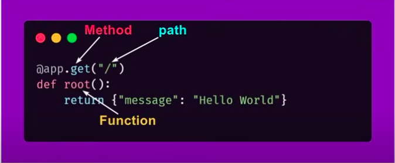

* for development the API can be run as a server by - 
	fastapi dev main.py                   
* run as a server -                    
	* command - uvicorn main:app --port=3000 --reload
	* main - name of code base           
	* --port   - a flag to indicate the port
	* --reload - a flag to indicate if to reload the server every time a change is done 
* path or endpoint
	eg URL - https://example.com/items/foo
	path - /items/foo
	When developing a API "path" is the main way to seperate "concerns" and "resources"                       

## RESTful API   
 * RESTful - **RE**presentational **S**tate **T**ransfer        
 * Were **full** suffix means that the system adheres to the principles of REST.                
 **Principles of REST**               
 1. Stateless - Each request from the client to the server must contain all the information needed to understand the process request. No client session information is stored in the server.          
 2. Client-Server Architecture - Client and server operate independently. The client is responsible for the user interface and makin requests, while the server manges the data and handles the requests.                          
 3. Uniform Interface - RESTful system use a uniform set of HTTP methods for comunication:
    * GET : retrieve resources
    * POST : create resources
    * PUT : update resources
    * DELETE : remove resources           
 4. Resource Representation - resources (data or objects) are identified by URIs (Uniform Resource Identifiers), and their state is transferred through representations, typically in formats like JSON or XML.                           
 5. Layered System -  The client does not need to know whether it is directly communicating with the end server or through intermediaries like load balancers, caches, or proxies - Responses from the server should be marked as cacheable or non-cacheable to improve performance and scalability by reducing unnecessary requests.                                            
 6. Cacheable - Responses from the server should be marked as cacheable or non-cacheable to improve performance and scalability by reducing unnecessary requests.                       
## CRUD
	C - Create (create data)
	R - Read (read data)
	U - Update (update data)
	D - Delete (delete data)
## HTTP Methods
	A REST-API uses HTTP methods to accomplish CRUD.
	C - POST
	R - GET
	U - PUT
	D - DELETE
## HTTP Methods in Fast API
	POST - @app.post()
	GET  - @app.get()
	PUT  - @app.put()
	DELETE - @app.delete()